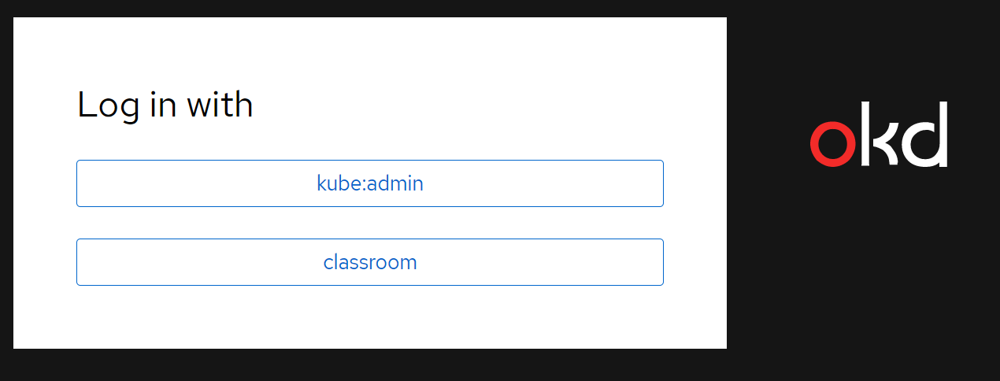

# OpenShift 4 Cluster Installation AWS

An easy installation for AWS OpenShift 4 cluster.

This repository shows;
- [Manual installation](ManualInstall.md)
- [Automated install](UsingAutomation.md)

Once your cluster is built you'll see in the output, or in the log file .openshift_install.log the URL and credentials for the kubeadmin.

After the **add-login** script has been executed you will have the following user;
- developer
- admin

With password of c0nygre.

You can then use the following from the command line to log in, once the cluster has added the config.

```
oc login https://api.${REGION}.openshift.conygre.com:6443 -u developer -p c0nygre
```

The web console should look as follows, once htpasswd has been configured;



Use the **classroom** to log on as **developer**

## Your own environment

To build your own environment you should do the following;

**For the AWS account:**

- Create a User called **OpenShiftAdmin**, no console access
- Create the Access Key for that user CLI only
- Create the 2 parameter store values for the keys **/OpenShiftAdmin/AccessId** and **/OpenShiftAdmin/Secret**
- Create the **OpenShiftAdmin** role with instance profile

**For the region**

- Create the EC2 instance and assign the profile (or if we make an AMI it will just be launch the instance and add the IAM role)  - Cloudformation could do this, or terraform
- Copy the bin directory from https://github.com/stevshil/OpenShift4 onto the server (but will be there if we make an image)

**For each cluster build per region**

- Modify the **bin/env** to build the cluster for the region
- Run **create-cluster** command

**NOTE**

The VM must remain in place but not up while the cluster lives, as it contains the terraform information that is required to destroy the cluster, which delete-cluster uses.